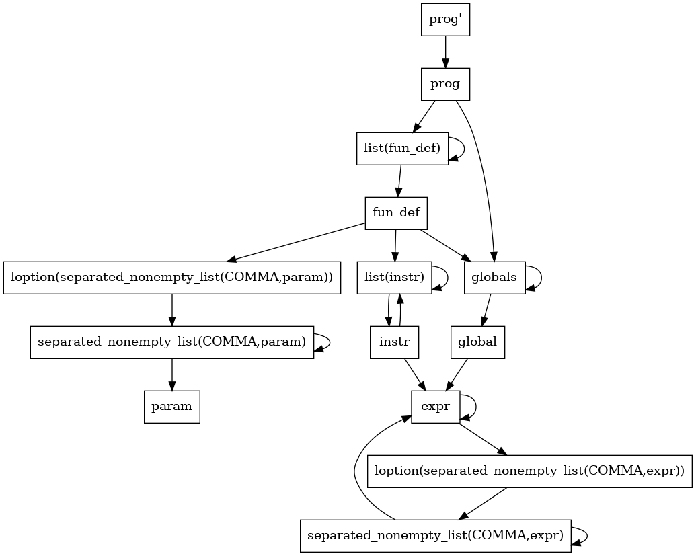

# Compilateur-MiniC - Decembre2020

# LDD3 MathsInfo - Alexandre PHAM _ Clémence SEBE

Accéder au sujet du DM en cliquant [ici](https://www.lri.fr/~blsk/CompilationLDD3/dm-mnc.html) .

## Informations

Commande pour compiler:

*ocamlbuild -use-menhir main.native*

Commande pour éxecuter:
*./main.native Exemple.c*

## Comment le compilateur fonctionne:
* Une analyse lexicale est réalisée.
* Une analyse syntaxique est réalisée. Voici l'arbre de la grammaire que menhir génère (à l'aide de l'option --graph) : 
* Enfin, vient l'étapde d'analyse du typage. Premièrement, notre compilateur vérifie qu'un main est bien présent. Dans le cas où ce n'est pas le cas, une erreur est déclenchée.
* Les globales sont toutes chargés une à une.
* Lorsqu'une fonction est analysée, nous créons un environnement qui contient:
    * Les variables globales.
    * Les paramètres.
    * Les variables locales.

* Dans les 3 cas, nous n'acceptons pas de "doublons".
    Par exemple la déclaration de 2 variables globales de même nom déclenche une erreur. 

* Cependant, si une nouvelle type de valeur a le même nom qu'une valeur précédemment déclaré, cette dernière est masquée et un avertissement est écrit par le compilateur signalant le masquage.
    Par exemple, une variable globale sera cachée si une fonction définit un paramètre de même nom.

## Ce qui a été implémenté:
* L'analyseur de type peut suggérer des noms de variables ou de fonctions si elles sont jugées pertinentes. Nous en discuterons plus loin de comment il fonctionne et ce qui pouvait être fait.

## Remarques

### Suggestion
Lorsqu'un nom de variable de fonction n'est pas reconnu, on essaye de voir dans l'environnement si un nom s'y rapproche en se basant sur ce critère:
1. Pour un mot m1, nous faisons la somme du code ASCII de chaque caractère du mot que l'on nomme s1.
2. De même pour un deuxième mot m2 et s2 et la somme défini de la même manière.
3. Posons : 
4. Si gap < 30%, nous considérons que les mots sont suffisaments proche pour être suggéré.

Posons alors pour le nom de variable m1 et m2 les autres noms de variables de l'environnement. Pour le cas ou m2 = m1 notre fonction qui juge renvoie faux.

Une autre possibilité aurait été de baser notre système sur la [Distance de Levenshtein](https://fr.wikipedia.org/wiki/Distance_de_Levenshtein) qui est très pertinente ici car elle caractérise / quantifie assez bien les erreurs de programmation qui sont:
* Inversion des positions de lettre.
* Quelques lettres en plus ou en moins.