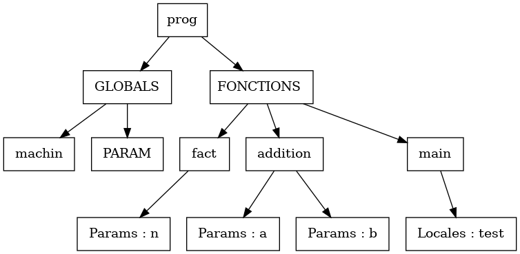

# Compilateur-MiniC - Decembre2020

# LDD3 MathsInfo - Alexandre PHAM _ Clémence SEBE

Accéder au sujet du DM en cliquant [ici](https://www.lri.fr/~blsk/CompilationLDD3/dm-mnc.html) .

## Informations

Commande pour compiler:

*ocamlbuild -use-menhir main.native*

Commande pour éxecuter:
*./main.native Exemple.c*

Pour lancer tout les tests disponibles:
*sh testAll.sh*

## Comment le compilateur fonctionne:
* Une analyse lexicale est réalisée.
* Une analyse syntaxique est réalisée. Voici l'arbre de la grammaire que menhir génère (à l'aide de l'option --graph) : 
* Enfin, vient l'étape de d'analyse du typage. Premièrement, notre compilateur vérifie qu'un main est bien présent. Dans le cas où ce n'est pas le cas, une erreur est déclenchée.
* Les variables globales sont toutes chargés une à une.
* Lorsqu'une fonction est analysée, nous créons un environnement (que nous expliquerons le fonctionnement) qui contient:
    * Les variables globales.
    * Les paramètres.
    * Les variables locales.
    * Les fonctions déjà définis dont elle même pour permettre la récursivité.
* Dans les 3 cas, nous n'acceptons pas de "doublons".
    Par exemple la déclaration de 2 variables globales de même nom déclenche une erreur. 
* Cependant, si une nouvelle type de valeur a le même nom qu'une valeur précédemment déclaré, cette dernière est masquée et un avertissement est écrit par le compilateur signalant le masquage.
    Par exemple, une variable globale sera cachée si une fonction définit un paramètre de même nom.
* Enfin, vient l'analyse des return.

### Un peu plus sur le langage 
* Les fonctions de type int et bool doivent absolument avoir au moins un return. De plus, l'expression des return doivent avoir le même type que la fonction.
* Les fonctions de type void ne doivent pas contenir de return.

### Changements apportés à la syntaxe abstraite
* Factorisation des opérations binaires
* Les *globals* et les *locals* sont des triplets string * type * expression. Pour l'analyseur de typage.
* Dans le type *expr*, rajout d'un constructeur CreaBool pour faciliter le travail de l'analyseur de typage.

## Ce qui a été implémenté:
* L'analyseur de type peut suggérer des noms de variables ou de fonctions si elles sont jugées pertinentes. Nous en discuterons plus loin comment il fonctionne et ce qui pouvait être fait.
* Les opérations binaire et l'opération de négation: Pour cette partie, une factorisation dans la grammaire abstraite a été faite en réunissant toutes les opérations binaires (type Binop).


## Remarques

### L'environnement
C'est une Hashmap ayant en clé le nom et en valeur un type somme pouvant être ou bien un *typ* ou bien une définition de fonction *fun_def*.

### Suggestion de nom
Lorsqu'un nom de variable de fonction n'est pas reconnu, on essaye de voir dans l'environnement si un nom s'y rapproche en se basant sur ce critère:
1. Pour un mot m1, nous faisons la somme du code ASCII de chaque caractère du mot que l'on nomme s1.
2. De même pour un deuxième mot m2 et s2 est la somme défini de la même manière.
3. Posons : 
4. Si gap < 21%, nous considérons que les mots sont suffisaments proche pour être suggéré.

Posons alors pour le nom de variable m1 et m2 les autres noms de variables de l'environnement. Pour le cas ou m2 = m1 notre fonction qui juge renvoie faux.

Pour affiner l'analyse, on aurait pu voir si l'identifiant erroné est un nom de variable ou de fonction, puis de  vérifier si le deuxième mot dans l'environnement est du même type que l'identifiant erroné.

Nous avons utilisé cette méthode car elle est simple à comprendre et programmer. Cependant, elle est trop "généreuse".

Une autre possibilité aurait été de baser notre système sur la [Distance de Levenshtein](https://fr.wikipedia.org/wiki/Distance_de_Levenshtein) dont une implémentation de l'algorithme est disponible sur[Rosetta Code](http://www.rosettacode.org/wiki/Rosetta_Code) qui est très pertinente. Elle fonctionne dans une logique différente. Dans notre cas elle caractérise / quantifie assez bien les erreurs de programmation (de frappe) qui sont:
* Inversion des positions de lettre.
* Quelques lettres en plus ou en moins.
L'algorithme prend 2 mots en entrée et nous renvois un nombre entier. Les résultats qui nous intéressent sont 1 ou 2 (éventuellement 3) car cela signifie que les mots sont proches. Le cas ou l'algorithme nous renvois 0 est pas utile  car cela signifie que les 2 mots sont les mêmes (définition de distance).
Malgré que la complexité de l'algorithme est importante, elle reste pertinente car les noms de variables sont en général assez court.

### Erreur fréquente: Point virgule manquant
Nous sommes tombé sur ce [site](https://baturin.org/blog/declarative-parse-error-reporting-with-menhir/)
De ce que nous avons compris:
* Créer un fichier via menhir qui nous indique comment nous pouvons avoir des erreurs dans notre analyse syntaxique via l'option *--list-errors*
* Modifier ce fichier avec les messages qui nous intéressent: Par exemple:

```
prog: BOOL IDENT AFF TRUE WHILE
##
## Ends in an error in state: 87.
##
## global -> BOOL IDENT AFF TRUE . SEMICOLON [ WHILE VOID R_ACC RETURN PUTCHAR NOT INT IF IDENT EOF CONST BOOL ]
##
## The known suffix of the stack is as follows:
## BOOL IDENT AFF TRUE
##

<YOUR SYNTAX ERROR MESSAGE HERE>
 ```
 
 Ici nous voyons que si on peut autre chose qu'un point virgule après true, nous avons une erreur et c'est ce que nous voulons.
 Nous pouvons alors remplacer 
 > \<YOUR SYNTAX ERROR MESSAGE HERE\>
 
 Par
 > Oubli d'un point virgule.
 
 * Ensuite, utiliser l'option de compilation menhir --compile-errors qui nous permet d'avoir un module ocaml.

 * L'utiliser dans l'analyseur lexical et syntaxique. C'est cette étape que nous trouvons compliqué.


 ### Début d'affichage.
 Cette partie ne se déroule que si toute les analyses présentes ont eu aucun échec.
Une tentative d'affichage sur Console a été fait et est disponible sous le nom de *Affichage2.ml* mais la partie utilisée est sur *Affichage.ml*

 Pour cette partie, on récupère les résultats de la partie d'analyse de typage.
 On récupère les variables globales et toutes les fonctions définies et on essaye de tracer un arbre en utilisant le plus possible un arbre. Notre meilleur résultat est (sur le fichier test *testSoft.c*.):
 
  


Ce fichier est obtenu en utilisant *graphviz* et la commande *dot -Tpng ArbreSyntaxeAbstr.dot -o ArbreAbstr.png*.
Le plus dur est:
* De ne pas s'emmêler sur la gestion des indices.
* Le faire de la manière le plus récursive possible tout en faisant attention aux indices.
* Nous avons réalisé plus tard  que nous étions pas obligés d'utiliser des numéros pour identifier les labels...

Si *graphviz* est installé, lancer *sh Draw.sh* compile le programme, le lance et génère le même arbre (sur *testSoft.c*).
L'idée de faire un arbre de cette manière nous vient du fait que *menhir* génère un graph de cette manière que ca nous semblait intéressant.